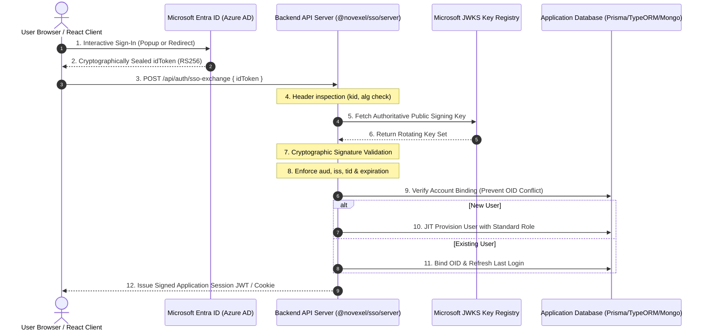

<div align="center">

<a href="https://novexel.co.uk" target="_blank">
  
</a>

# @novexel/sso

### Enterprise-Grade Zero-Trust Microsoft Entra ID & MSAL Single Sign-On

[](LICENSE)
[](https://novexel.co.uk)
[](https://github.com/OWASP/cve-lite-cli)
[](#)
[](#)

[**Novexel Technologies**](https://novexel.co.uk) • London, United Kingdom  
*Engineering secure software solutions, enterprise cloud infrastructure, and cybersecurity services globally.*

---

</div>

## 📌 Executive Summary

**`@novexel/sso`** is a production-grade, zero-trust authentication module that connects Node.js backends and React frontends with Microsoft Entra ID (Azure Active Directory) and Microsoft Authentication Library (MSAL).

Designed and engineered by the cybersecurity and software engineering team at **[Novexel](https://novexel.co.uk)**, this package eliminates identity forgery vectors by decoupling client identity assertions from authoritative backend verification.

> [!IMPORTANT]
> **Open Source & AI-Tool Friendly:** Released under the permissive **MIT License**. It is architected so human developers and AI coding agents can seamlessly inspect, drop in, and adapt it across multi-tenant SaaS platforms or standalone enterprise portals.

---

## 🏛️ Security Architecture & Threat Model

Traditional SSO implementations often suffer from critical identity spoofing flaws: they trust claims (e.g. `{ email: user@company.com }`) sent directly in HTTP payloads by client applications. 

`@novexel/sso` enforces a strict **Zero-Trust Cryptographic Perimeter**:



### Key Security Safeguards

1. **Zero Client Trust:** HTTP body assertions like `email`, `role`, or `tenantKey` are completely ignored. Identity is derived strictly from Microsoft's cryptographically sealed token claims.
2. **Signature & Algorithm Enforcement:** Every token is verified against Microsoft's live rotating JWKS keys. Only `RS256` is permitted, completely blocking `alg: "none"` or symmetric key substitution attacks.
3. **Audience & Directory Scoping:** Tokens must match your application's `clientId` and dedicated directory `tenantId`. Generic multi-tenant strings (`common`, `organizations`) are rejected by default.
4. **Account Takeover Protection:** If an account already exists with Entra Object ID `X`, an incoming token claiming the same email address but presenting Object ID `Y` immediately triggers an `ACCOUNT_BINDING_CONFLICT` (403), protecting against directory collision and email recycling takeovers.
5. **Audited by OWASP Tools:** Validated clean with `0 vulnerabilities` via OWASP `cve-lite-cli`.

---

## 📦 Installation

Install `@novexel/sso` along with MSAL and cryptographic verification peer dependencies:

```bash
# Using npm
npm install @novexel/sso @azure/msal-browser @azure/msal-react jsonwebtoken jwks-rsa

# Using yarn
yarn add @novexel/sso @azure/msal-browser @azure/msal-react jsonwebtoken jwks-rsa

# Using pnpm
pnpm add @novexel/sso @azure/msal-browser @azure/msal-react jsonwebtoken jwks-rsa
```

---

## 🚀 Quickstart Guide

### 1. Server Setup (Express / Node.js)

The server module provides `createSSOExchangeHandler` with a pluggable `UserStorageAdapter` that connects directly to Prisma, TypeORM, Mongo, Drizzle, or custom in-memory stores.

```typescript
import express from 'express';
import jwt from 'jsonwebtoken';
import { createSSOExchangeHandler, UserStorageAdapter } from '@novexel/sso/server';
import { prisma } from './db'; // Your Prisma or ORM client

const app = express();
app.use(express.json());

// A. Implement the decoupled User Storage Adapter
const storageAdapter: UserStorageAdapter = {
  async findByEmail(email) {
    return prisma.user.findUnique({ where: { email } });
  },
  async findByOid(oid) {
    return prisma.user.findUnique({ where: { entraObjectId: oid } });
  },
  async bindOid(userId, oid, identity) {
    return prisma.user.update({
      where: { id: userId },
      data: { entraObjectId: oid, lastLogin: new Date() }
    });
  },
  async createUser(identity) {
    // Just-In-Time (JIT) Provisioning
    return prisma.user.create({
      data: {
        email: identity.email,
        name: identity.name,
        entraObjectId: identity.oid,
        role: 'User',
        lastLogin: new Date()
      }
    });
  },
  async updateLastLogin(userId) {
    await prisma.user.update({
      where: { id: userId },
      data: { lastLogin: new Date() }
    });
  }
};

// B. Attach the exchange endpoint
app.post(
  '/api/auth/sso-exchange',
  createSSOExchangeHandler({
    config: {
      clientId: process.env.AZURE_CLIENT_ID!,
      tenantId: process.env.AZURE_TENANT_ID!
    },
    storageAdapter,
    sessionGenerator: {
      async generateSession(user, identity) {
        const token = jwt.sign(
          { id: user.id, email: user.email, role: user.role },
          process.env.JWT_SECRET!,
          { expiresIn: '24h' }
        );
        return { token, userPayload: user };
      }
    },
    auditLogger: {
      log(event) {
        console.log(`[SEC-AUDIT] ${event.eventType} for ${event.userEmail || 'unknown'}`);
      }
    }
  })
);
```

---

### 2. Client Setup (React)

Wrap your React root with `<NovexelAuthProvider>` and use `<MicrosoftSignInButton>` or the `useNovexelSSO` hook anywhere in your component tree.

```tsx
import React from 'react';
import ReactDOM from 'react-dom/client';
import {
  NovexelAuthProvider,
  useNovexelSSO,
  MicrosoftSignInButton
} from '@novexel/sso/client';

export function App() {
  return (
    <NovexelAuthProvider
      config={{
        clientId: 'YOUR_ENTRA_CLIENT_ID',
        tenantId: 'YOUR_ENTRA_DIRECTORY_TENANT_ID'
      }}
      exchangeEndpoint="/api/auth/sso-exchange"
      onSessionCreated={({ token, user }) => {
        console.log('Session created!', user);
        localStorage.setItem('authToken', token);
      }}
      onError={(err) => console.error('SSO Error:', err)}
    >
      <MainPortal />
    </NovexelAuthProvider>
  );
}

function MainPortal() {
  const { isAuthenticated, identity, logout, isLoading } = useNovexelSSO();

  if (isLoading) {
    return <div className="loading-spinner">Authenticating with Microsoft...</div>;
  }

  if (!isAuthenticated || !identity) {
    return (
      <div style={{ textAlign: 'center', padding: '60px 20px' }}>
        <h2>Sign in to Your Organization</h2>
        <p>Access your portal securely via Single Sign-On.</p>
        <div style={{ marginTop: '20px' }}>
          <MicrosoftSignInButton text="Sign in with Work Account" theme="light" mode="popup" />
        </div>
      </div>
    );
  }

  return (
    <div style={{ padding: '40px' }}>
      <h2>Welcome back, {identity.name}</h2>
      <p><strong>Email:</strong> {identity.email}</p>
      <p><strong>Directory Tenant:</strong> {identity.tid}</p>
      <button onClick={() => logout()}>Sign out</button>
    </div>
  );
}

ReactDOM.createRoot(document.getElementById('root')!).render(<App />);
```

---

## 🌐 Dynamic Multi-Tenant Resolution

For multi-tenant SaaS platforms where each tenant possesses a unique Entra ID app registration:

```typescript
import { createSSOExchangeHandler } from '@novexel/sso/server';

app.post(
  '/api/auth/sso-exchange',
  createSSOExchangeHandler({
    // Dynamically resolve configuration from host or subdomain
    config: async (req) => {
      const hostname = req.headers.host || '';
      const tenant = await findTenantByHostname(hostname);
      if (!tenant || !tenant.ssoEnabled) return null;

      return {
        clientId: tenant.ssoClientId,
        tenantId: tenant.ssoTenantId
      };
    },
    storageAdapter,
    sessionGenerator
  })
);
```

---

## 🛡️ Endpoint Protection Middleware

Secure specific Express routes using `requireEntraAuth`:

```typescript
import { requireEntraAuth } from '@novexel/sso/server';

app.get(
  '/api/secure-data',
  requireEntraAuth({
    clientId: process.env.AZURE_CLIENT_ID!,
    tenantId: process.env.AZURE_TENANT_ID!
  }),
  (req, res) => {
    // req.novexelIdentity is cryptographically guaranteed
    res.json({
      message: 'Access granted',
      user: req.novexelIdentity
    });
  }
);
```

---

## 🧪 Testing & Quality Assurance

Run the cryptographic regression suite:

```bash
npm test
```

Test cases cover:
- Alg:none injection attacks
- Signature tampering
- Expired and not-yet-valid tokens
- Key-identifier (kid) lookup failures
- Multi-tenant boundary isolation
- Audience and issuer validation

---

## 🏢 About Novexel

[**Novexel Tech Limited**](https://novexel.co.uk) is a London-based technology company delivering custom software engineering, enterprise cloud architecture, and cybersecurity services for businesses and public sector organizations globally.

- **Website:** [https://novexel.co.uk](https://novexel.co.uk)
- **Email:** [info@novexel.co.uk](mailto:info@novexel.co.uk)
- **HQ:** First Floor Office, 3 Hornton Place, London, W8 4LZ, United Kingdom

---

## 📄 License

Distributed under the **MIT License**. Copyright (c) 2026 **Novexel Tech Limited**.
